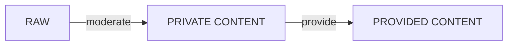
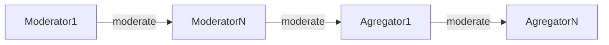
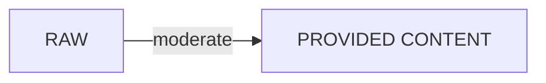
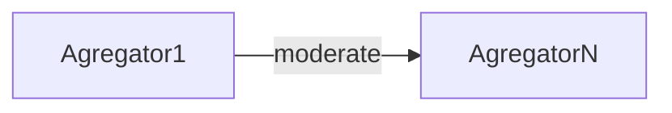
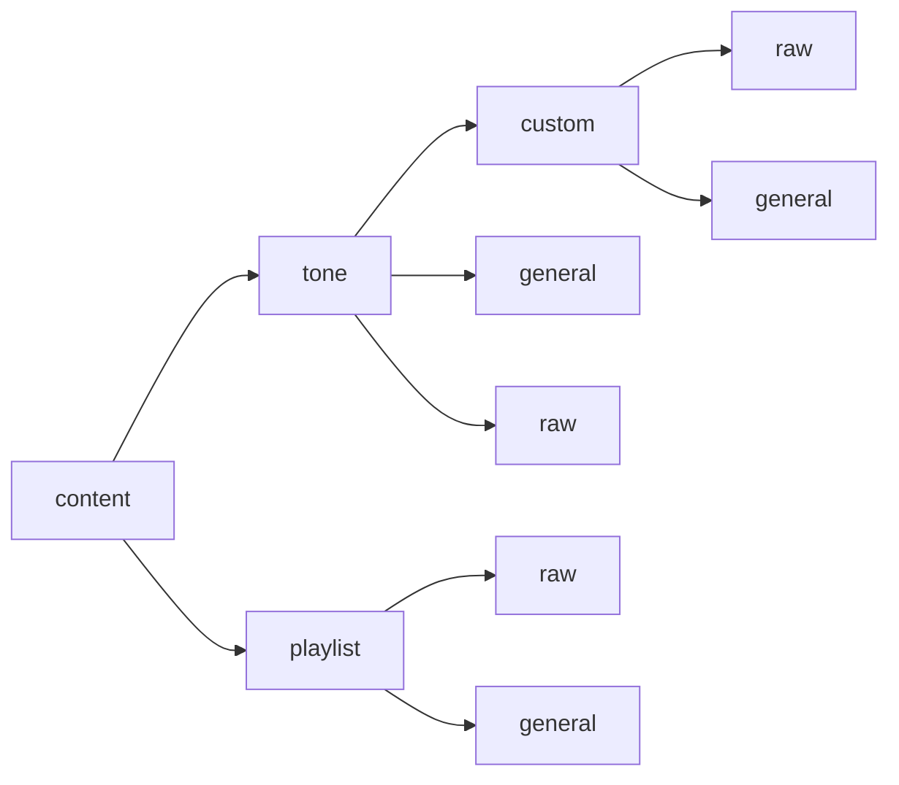

# DPDP

Ссылки:
- [Термины](#terms)
- [Tone, Playlist, DIY](#content)
- [Структура директорий контента](#content-tree)
- [User managment](#user)
- [Artist](#artist)
- [Album](#album)
- [License](#license)
- [Category](#category)
- [Price](#price)
- [App settings](#settings)
- [Tone list](#tone-list)
- [Audit](#audit)
- [SMS Templates](#sms-templates)
- [Rbt Packages](#rbt-packages)
- [Subscriber](#subscriber)

## Content

### Типы контента:
- Raw (Сырой контент) - контент, который еще не прошел модерацию
  > таблицы в БД **raw_tone** и **raw_playlist**
- Private (Контент) - контент, который прошел модерацию, но не запровайжен
  >таблицы в БД **tone** и **playlist**
- Provided (Провайдед контент) - контент, который запровайжен провайдером
  >таблица в БД **provided_content**
- DIY (Кастомный контент) - контент, загруженный subscriber`ом с RBT
  > Только мелодии (tone)
  Таблицы в БД:  
  **raw_custom_tone** - хранит сырой DIY контент  
  **provided_content** - хранит модерированный DIY контент, но **creator_id = null**


### Жизненный цикл контента (**не DIY**):

#### Технически
1) Контент загружается провайдером через WEB (вкладка *Tone* или *Playlist*).  
   Создается запись сырого контента, где в поле модератор (*moderator_id*) выставляется первый модератор провайдера, который загрузил контент, если у провайдера нет модераторов, то выставляется первый агрегатор.  
   По айдишнику сырой сущности из БД записывается файл в `raw` директорию  
   Созданная запись отобразится во вкладке `Tone -> Requests`  
2) Контент проходит модерацию.  
   Модерация начинается с модераторов, которые есть у провайдера. Заканчивается агрегатором, если их несколько, то последним.  
   2.1 Если у провайдера несколько модераторов.  
   При успешной модерации он переходит к следующему модератору. Контент должен пройти всю цепочку модераторов провайдера. От последнего модератора он переходит к первому агрегатору.  
   2.2 Если у провайдера один модератор.  
   При успешной модерации контент переходит на модерацию первому агрегатору.  
   2.3 Если у провайдера нет модераторов.  
   Контент сразу переходит первому агрегатору.  
   При успешном цикле модерации создается запись приватного контента и удаляется запись сырого.  
   При не успешной модерации на любом из этапов - сырой контент удаляется.

3) Контент провайдится.  
   *Telenor*  
   Для данного заказчика провайдинг происходит автоматически, когда цикл модерации закончен успешно (последний агрегатор подтвердил модерацию).  
   При успешном цикле модерации и создании записи приватного контента, инициируется запись провайдед контента и отправляется файл на `DPDP.core`.  
   `DPDP.core` возвращает созданную у себя запись и `DPDP.web` создает запись провайдед контента, **с тем id, который вернул DPDP.core**

### Жизненный цикл контента (**DIY**):

#### Технически
1) Контент загружается пользователем через `RBT.web` (вкладка *Upload your music*).  
   Создается запись сырого DIY контента, где в поле модератор (*moderator_id*) выставляется первый агрегатор.  
   По айдишнику сырой сущности из БД записывается файл в `raw` директорию  
   Так же создается запись на DPDP.core для того, чтобы списать деньги с абонента.  
   Созданная запись отобразится во вкладке `Tone -> DIY`  
2) Контент проходит модерацию.  
   DIY контент модерируется только агрегаторами.  
   При успешном цикле модерации инициируется запись провайдед контента и отправляется файл на `DPDP.core`. На `DPDP.core` апдейтится созданная до этого запись и `DPDP.web` создает запись провайдед контента, **с тем id, который вернул DPDP.core**  
   При не успешной модерации на любом из этапов сырой DIY контент удаляется.

## Content tree
### Дерево директорий контента
В `raw` - хранятся файлы сырого контента  
В `general` - файлы контента, прошедший модерацию  
**Note**: DIY файлы хранятся в отдельной папке (custom), для которого так же есть `raw` и `general`


Файлы контента хранятся и получаются по ID.

## User

В `DPDP.web` существует три типа юзеров:

### Типы юзеров:
- Provider (Провайдер) - загружает контент
- Moderator (Модератор) - принадлежит провайдеру, модерирует контент
- Agregator (Агрегатор) - модерирует контент

### Технически
Провайдер может иметь :
- одного модератора
- нескольких модераторов
- не иметь модераторов вообще

Агрегатор независим. В системе :
- должен быть минимум один агрегатор
- может быть несколько агрегаторов


## Terms

###  Модерация
Модерация контента (*Tone*, *Playlist*, *DIY*) описана в **Content (Tone и Playlist)**

Модерация *Альбома*, *Артиста*, *Лицензии* происходит по следующему сценарию:
1. У сырой сущности берется поле `moderator_id` - это текущий модератор
2. Текущий модератор делает `Accept` (подтверждает модерацию)  
   2.1 Если у провайдера есть еще модераторы, то в сырой записи апдейтится поле `moderator_id` и туда записывается следующий модератор.  
   2.2 Если текущий модератор последний, то запись переходит первому агрегатору.  
3. Текущий агрегатор делает `Accept`  
   3.1 Если в системе есть еще агрегаторы, то в сырой записи апдейтится поле `moderator_id` и туда записывается следующий агрегатор.
4. Модерация заканчивается тогда, когда последний агрегатор подтвердил модерацию.  
   При успешном цикле модерации:
- создается новая сущность (апдейтится старая)
- сырая удаляется
- файлы из `raw` переносятся в `general`
5. Если на каком-то из этапов происходит `Reject`, то сырая запись и файл сырой записи удаляются.

###  Загрузка
Загрузка контента (*Tone*, *Playlist*, *DIY*) описана в **Content (Tone и Playlist)**

Загрузка *Альбома*, *Артиста*, *Лицензии* происходит по следующему сценарию:
1. Провайдер загружает через WEB сущность
2. Инициируется сырая сущность  
   2.1 creator - выставляется текущий провайдер, который загрузил  
   2.2 moderator - выставляется первый модератор провайдера, если его нет, то первый агрегатор в системе.  
3. Сырая сущность сохраняется в БД
4. По айдишнику сырой сущности из БД записывается файл в `raw` директорию

## Album
Сущность описывающая музыкальный альбом. Вкладка на WEB `Albums`  
Существует в рамках Артиста, без него не может быть создана. Мелодия может быть создана без альбома.  
В качестве файла храним обложку альбома.
#### Структура директории
 ```mermaid
graph LR
A[album]
A --> D[raw]
A --> E[general]
```

Обложка альбома хранится и получается по ID записи из БД.

## Artist
Сущность описывающая артиста. Вкладка на WEB `Artists`  
Необходим для создания мелодии.  
В качестве файла храним обложку артиста.
#### Структура директории
 ```mermaid
graph LR
A[artist]
A --> D[raw]
A --> E[general]
```

Обложка артиста хранится и получается по ID записи из БД.

## Category
Сущность описывающая категорию. Вкладка на WEB `Categories`  
Таблица в БД: `category`  
Необходим для создания мелодии или альбом.

## Price
Сущность описывающая категорию цены. Вкладка на WEB `Prices`  
Хранится на `DPDP.core`  
`renewal_fee` - цена продления  
`purchase_fee` - цена покупки  
Необходим для создания мелодии или плейлиста.


## Settings
Сущность описывающая настройки приложения. Вкладка на WEB `Settings`  
Таблица в БД: `app_settings`   
`Custom's tone price` - цена для загружаемого DIY контента  
`Default content` - системная мелодия по умолчанию. Хранится на RBT WEB

## Tone list
Сущность описывающая именованный список мелодий. Вкладка на WEB `Tone list`  
Таблица в БД: `content_list`  
Используется сторонними сервисами

## Audit
Сущность описывающая аудит системы. Вкладка на WEB `Audit`  
Таблица в БД: `audit`  
Хранит аудит DPDP web + RBT web

## SMS Templates
Сущность описывающая шаблоны для отправки сообщений абоненту. Вкладка на WEB `Sms Templates`  
Хранится на `DPDP.core`  
Существует определенный набор шаблонов - он определен на DPDP.core, на DPDP web заполняется текст этих шаблонов на двух языках + подставляются переменные вида `$MSISDN`.

## License
Сущность описывающая лицензии (LOR). Вкладка на WEB `License`  
Таблица в БД: `license`  
Обязательна для создания мелодии, причем нельзя создать мелодии с просроченной лицензией.
#### Технически
1. Можно обновить лицензию и сделать дату (`expire_time`) меньше текущей. Тогда весь контент, который был загружен под этой лицензий станет просроченным и недоступным.  
   Технически - поле `is_expire = true` в таблице `provided_content`
2. Можно обновить провайдера у лицензии. Делается через специальную форму на DPDP web в столбце `creator`
3. В системе существует планировщик (Scheduler), который запускается раз в день и ищет просроченные лицензии. Если такие находятся, то для контента, загруженного под этой лицензией выполняется логика из п.1.   
   Cron scheduler  = `0 0 12 * * ?`

#### Структура директории
 ```mermaid
graph LR
A[license]
A --> D[raw]
A --> E[general]
```   

## Rbt Packages
Сущность описывающая подписки для RBT. Вкладка на WEB `Rbt Packages`  
Хранятся на `DPDP.core`  
Имеет параметр price category, который в свою очередь определяет цену подписки и цену продления

Триал пакет должен иметь ОДНО из двух свойств:  
**Opt-in пакет** - свойство триал пакета, если включен то по-умолчанию отписывает абонента от триал пакета (в том случае если абонентом не был дан смс-ответ явно)  
**Opt-out пакет** - свойство триал пакета, если включен то по-умолчанию подписывает абонента на триал пакет  

#### Технически
Понятия `service`,  `service_variant`,  `product`
- `product` - исходная сущность, которая хранит в себе `service`. В данном контексте `product` - это RBT.
- `service` - исходная сущность для описания сервисов (пакетов). В данном контексте существует два: `RBT` и `RRBT (Anti RBT)`
- `service_variant` - это вариация `service` для `product`. Например, сервисы `RBT` с разной ценой, каналом покупки и т.д
 ```mermaid
graph LR
A[product - RBT]
A --> B[service - RBT]
A --> C[service - RRBT]
B --> D[service_variant - RBT Monthly]
B --> E[service_variant - RBT Daily]
C --> F[service_variant - RRBT Monthly]
C --> G[service_variant - RRBT Daily]
```
В подписках всегда оперируем `service_variant` ID  
У одного абонента может быть активно одновременно и `RBT` `Anti RBT`сервис. Но в рамках одного сервиса только один `service_variant`, т.е нельзя иметь активным `Monthly` и `Daily` одновременно в рамках `RBT` сервиса.

## Subscriber
Сущность описывающая инфу об абоненте. Вкладка на WEB `Subscribers`  
Хранится на `DPDP.core`
#### Технически
`Sign in to RBT`  
На RBT web посылается запрос на получение кода для авторизации. После получения кода происходит редирект на RBT web.  
Редирект вида `../rbt?token=12345678`  
**Note**: код на RBT web хранится ограниченное количество времени, после успешного логина - удаляется.

